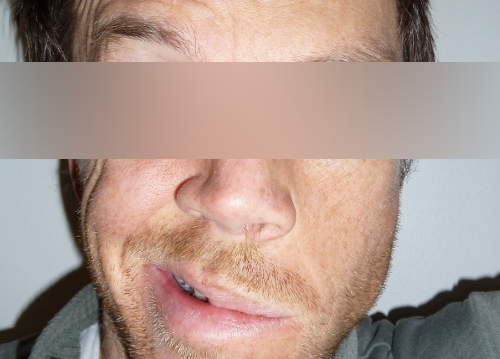

<h2>A Paralisia Facial é um distúrbio (parésia) ou uma paralisia total de todos, ou alguns, músculos da expressão facial.</h2>

Últimos artigos

<ul class="index">
  
    <li><a href="{{ post.url }}">{{ post.title }}</a> {{ post.date | date: "%-d/%m/%Y" }}</li>
  
</ul>

 

Paralisia Facial

* [Paralisia](paralisia-facial-paralisia.html)
* [Definição](paralisia-facial-definicao.html)
* [Incidência](paralisia-facial-incidencia.html)
* [Etiologia](paralisia-facial-etiologia.html)
* [Sinais e sintomas](paralisia-facial-sinais-e-sintomas.html)
* [Diagnóstico](paralisia-facial-diagnostico.html)
* [Diagnóstico Diferencial](paralisia-facial-diagnostico-diferencial.html)
* [Prognóstico](paralisia-facial-prognostico.html)
* [Tratamento](paralisia-facial-tratamento.html)
* [Tratamento em Fisioterapia](paralisia-facial-fisioterapia.html)
* [Exercícios Faciais](paralisia-facial-exercicios-faciais.html)
* [Paralisia de Bell](paralisia-de-bell.html)

Face

* [Ossos da Face](paralisia-facial-ossos-da-face.html)
* [Pele da face](paralisia-facial-pele-da-face.html)
* [Músculos da Face](musculos-da-face.html)
* [Enervação da Face](enervacao-da-face.html)
* [Vascularização da face](vascularizacao-da-face.html)
* [Nervos cranianos](paralisia-facial-nervos-cranianos.html)